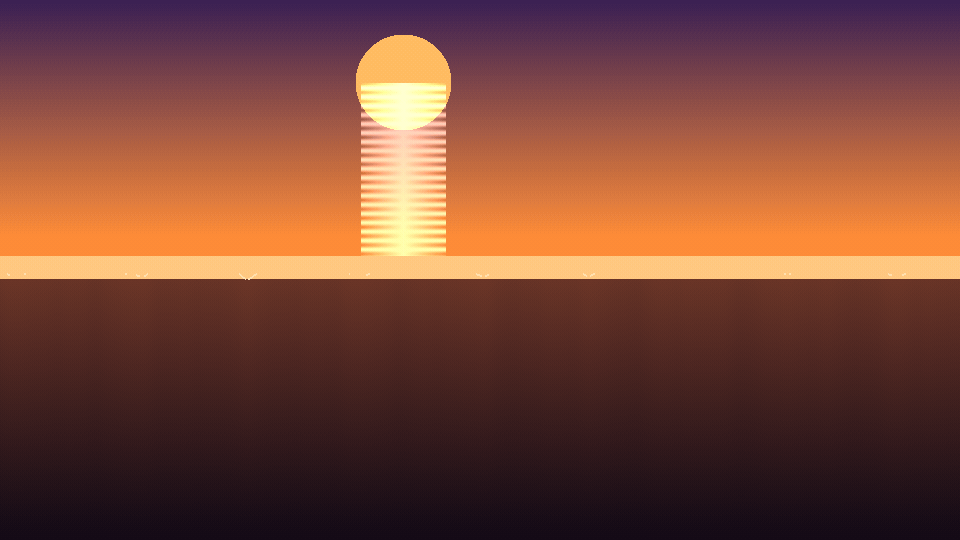
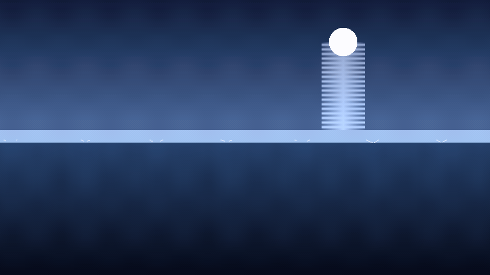
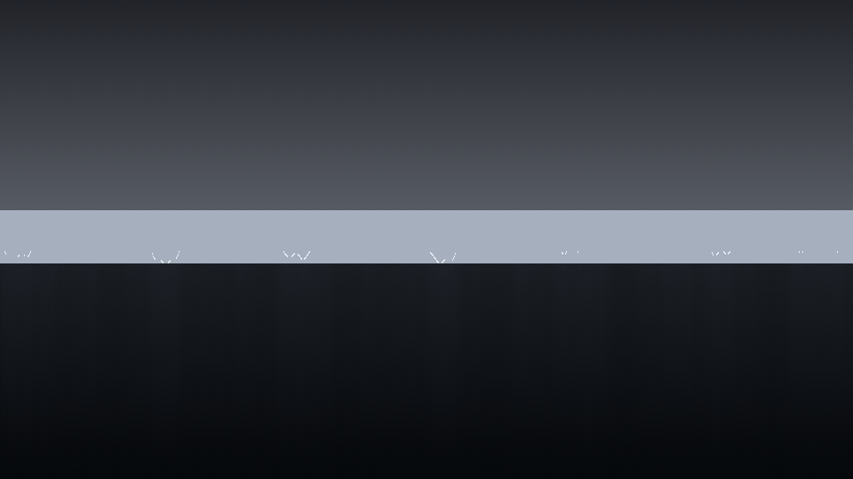
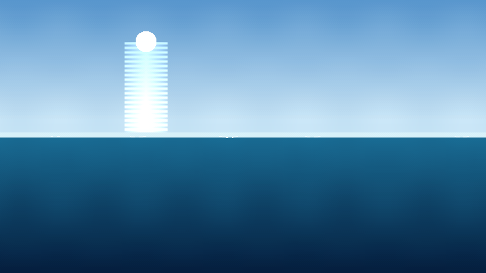

# 🌊 ocean-cinema

**EN:** A Gerstner-wave ocean simulator built from scratch in NumPy — deep-water dispersion relation (ω = √(gk)), multi-wave superposition, foam on breaking crests, sun/moon glitter paths. Four moods of the sea, filmed as looping GIFs. **This engine is imported by [`ship-cinema`](https://github.com/efealtiparmakoglu/ship-cinema)** to float ships on real wave physics.

**TR:** Gerstner dalga denizi simülatörü — derin su dispersiyonu (ω = √(gk)), çoklu dalga süperpozisyonu, kırılan tepelerde köpük, ay/güneş glitter yolu. Denizin dört farklı ruh hali, döngülü GIF'ler olarak. **Bu motor [`ship-cinema`](https://github.com/efealtiparmakoglu/ship-cinema) tarafından import edilerek gemiler bu denizde yüzdürülüyor.**



## 🖼️ Gallery / Galeri

### 🌕 Ay — moonlight

Full moon, silver glitter path, four-wave swell. — *Dolunay, gümüş glitter yolu, dört dalgalı deniz.*

### 🌅 Gün Batımı — sunset

Purple-to-orange sky, the sun sinking into its own glitter column. — *Mordan turuncuya gökyüzü, güneş kendi ışık sütununa gömülüyor.*

### ⚡ Fırtına — storm

Five stacked wave trains, foam caps on every crest. — *Beş üst üste dalga treni, her tepede köpük.*

### 🏝️ Sakin — calm

Tropical morning: three gentle swells, glassy water. — *Tropikal sabah: üç nazik dalga, camsı deniz.*

## 🧱 Physics / Fizik

| Piece | Detail |
|---|---|
| 🌊 Waves | Gerstner sum; deep-water dispersion **ω = √(g·k)**, k = 2π/λ |
| 📈 Surface | Height profile Σ A·sin(k·x·cosθ − ωt) rendered per column |
| 🫧 Foam | Crest detection: height + steepness thresholds → white caps |
| ☀️ Light | Celestial disk + glitter column, vertical sky gradient |

## ✅ Verification / Doğrulama

```bash
python3 tests/verify.py
```

- **Dispersion gate**: measured wave period = analytic 2π/√(gk) within 1% — %0.1
- **Superposition**: wave sum equals sum of individual waves (linearity)
- **Mean sea level** stays |y| < 0.02 over long runs
- **Shorter wavelength oscillates faster** (ω = √(gk) ordering)
- **Determinism**: same input → same profile

## 🚀 Usage / Kullanım

```bash
pip install numpy
python3 ocean.py --scene scenes/gunbatimi.json
```

## 🧪 Why / Neden

**TR:** Deniz "mavi düzlem + beyaz çizgi" çizerek simüle edilmez. Bu proje: her dalga bir dispersiyon ilişkisiyle gezen gerçek bir osilatör; köpük, kırılma eşiğinden; glitter, güneş altındaki geometrik yoldan çıkar. Ve en önemlisi: bu deniz, gemi simülatörünün (ship-cinema) fizik motorudur — iki repo tek evreni paylaşır.

## 📄 License

MIT
