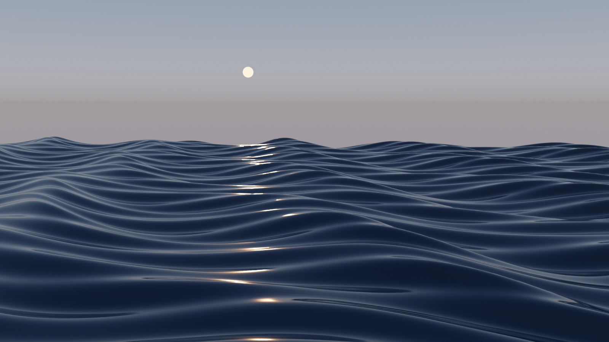
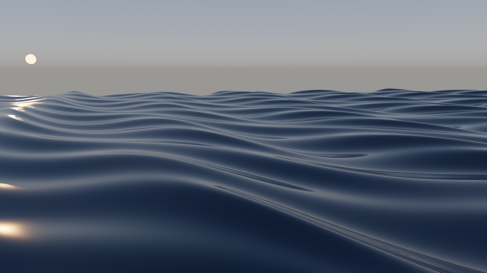
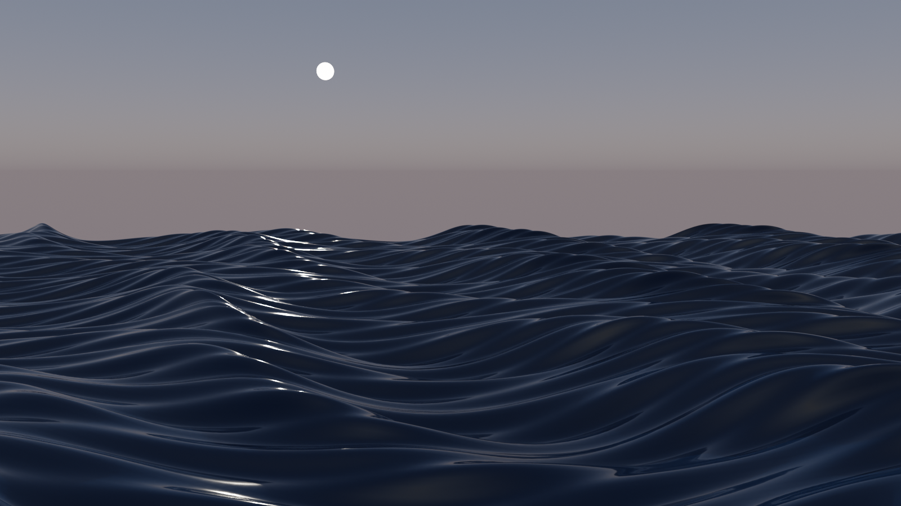
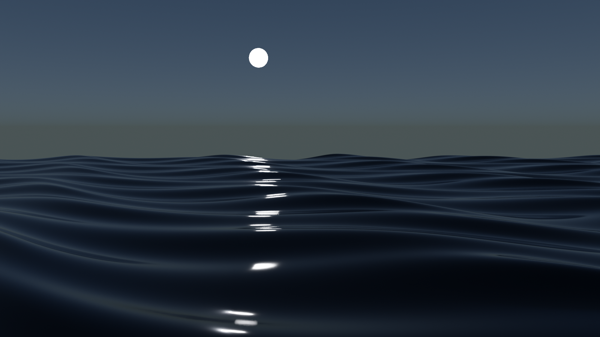
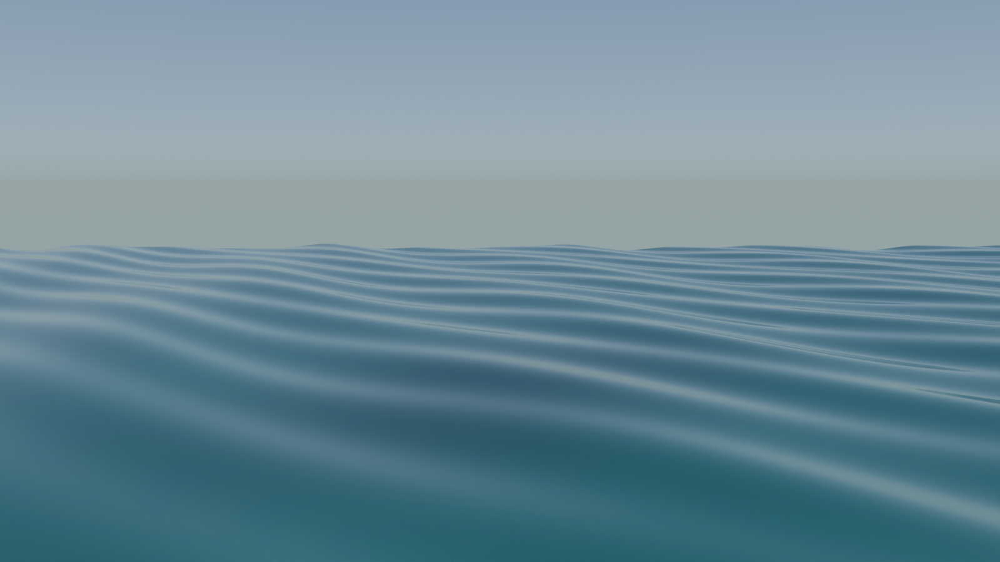
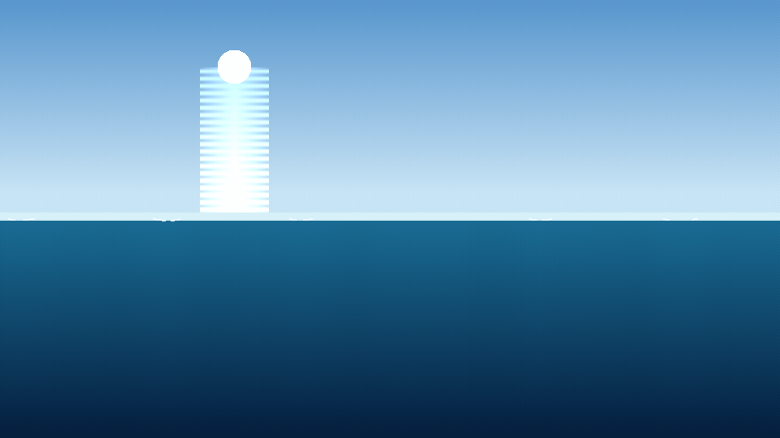

# 🌊 ocean-cinema

**EN:** A Gerstner-wave ocean simulator built from scratch in NumPy — deep-water dispersion relation (ω = √(gk)), multi-wave superposition, foam on breaking crests, sun/moon glitter paths. Four moods of the sea, filmed as looping GIFs. **This engine is imported by [`ship-cinema`](https://github.com/efealtiparmakoglu/ship-cinema)** to float ships on real wave physics.

**TR:** Gerstner dalga denizi simülatörü — derin su dispersiyonu (ω = √(gk)), çoklu dalga süperpozisyonu, kırılan tepelerde köpük, ay/güneş glitter yolu. Denizin dört farklı ruh hali, döngülü GIF'ler olarak. **Bu motor [`ship-cinema`](https://github.com/efealtiparmakoglu/ship-cinema) tarafından import edilerek gemiler bu denizde yüzdürülüyor.**



*Blender Cycles 3D Gerstner render — golden-hour glitter column.*

## 🖼️ Gallery / Galeri

### 🌅 Gün Batımı — sunset · `ocean_render.py`

Low sun on the horizon, its light path breaking across the swell. — *Ufukta alçak güneş, ışık yolu dalgalarda kırılarak geliyor.*

### ⚡ Fırtına — storm · `ocean_render.py`

Five stacked wave trains under a turbid sky, whitecaps on every crest. — *Bulanık gökyüzü altında beş üst üste dalga treni, her tepede köpük.*

### 🌙 Ay Gecesi — moonlight · `ocean_render.py`

A full moon pouring a silver glitter column onto dark water. — *Dolunay koyu suya gümüş bir ışık sütunu döküyor.*

### 🏝️ Tropikal — tropical · `ocean_render.py`

Crystal-clear teal water, three gentle swells, glassy morning light. — *Billur berraklığında turkuaz su, üç nazik dalga, camsı sabah ışığı.*

### 🎞️ 2D motor — döngülü GIF'ler (`ocean.py`)

Aynı fizik motorunun piksel-render hali: her kare NumPy ile hesaplanır.

| | | |
|---|---|---|
|  |  |  |
| 🌕 Ay | 🏝️ Sakin | 🌅 Gün Batımı |

## 🧱 Physics / Fizik

| Piece | Detail |
|---|---|
| 🌊 Waves | Gerstner sum; deep-water dispersion **ω = √(g·k)**, k = 2π/λ |
| 📈 Surface | Height profile Σ A·sin(k·x·cosθ − ωt) rendered per column |
| 🫧 Foam | Crest detection: height + steepness thresholds → white caps |
| ☀️ Light | Celestial disk + glitter column, vertical sky gradient |
| 🖼️ Stills | Her sahnenin son karesi PNG olarak da durur (renders/*.png) |

## ✅ Verification / Doğrulama

```bash
python3 tests/verify.py
```

- **Dispersion gate**: measured wave period = analytic 2π/√(gk) within 1% — %0.1
- **Superposition**: wave sum equals sum of individual waves (linearity)
- **Mean sea level** stays |y| < 0.02 over long runs
- **Shorter wavelength oscillates faster** (ω = √(gk) ordering)
- **Determinism**: same input → same profile

## 🚀 Usage / Kullanım

```bash
pip install numpy
# 2D motor — döngülü GIF
python3 ocean.py --scene scenes/gunbatimi.json

# 3D Cycles render (Blender 4.2+ / 5.x)
blender --background --python ocean_render.py -- --scene scenes/ay_gece.json
HIZLI=1 blender --background --python ocean_render.py -- --scene scenes/ay_gece.json  # hızlı önizleme
```

Sahne JSON'ları: `ocean` (dalga trenleri, choppiness, su rengi), `sun` (elevation/azimuth, lamba rengi, `disk`), `sky` (turbidity, strength, az_offset), `camera` (position/look_at/lens), `render` (çözünürlük, samples, exposure, look).

## 🧪 Why / Neden

**TR:** Deniz "mavi düzlem + beyaz çizgi" çizerek simüle edilmez. Bu proje: her dalga bir dispersiyon ilişkisiyle gezen gerçek bir osilatör; köpük, kırılma eşiğinden; glitter, güneş altındaki geometrik yoldan çıkar. Ve en önemlisi: bu deniz, gemi simülatörünün (ship-cinema) fizik motorudur — iki repo tek evreni paylaşır.

## 📄 License

MIT
